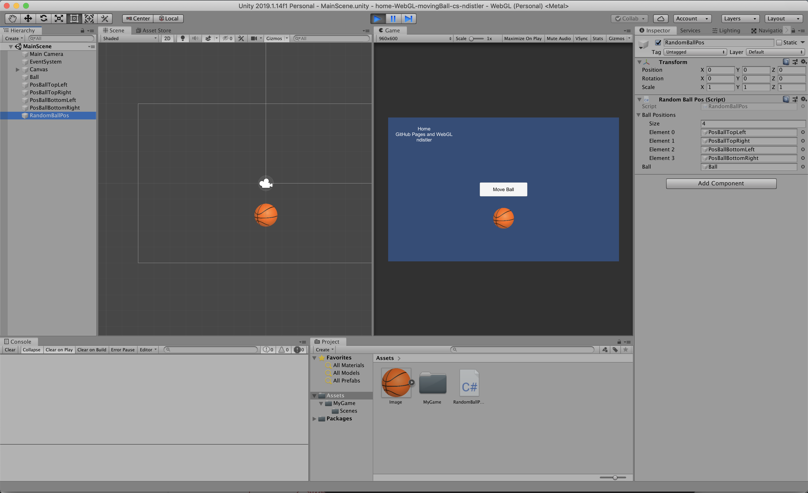
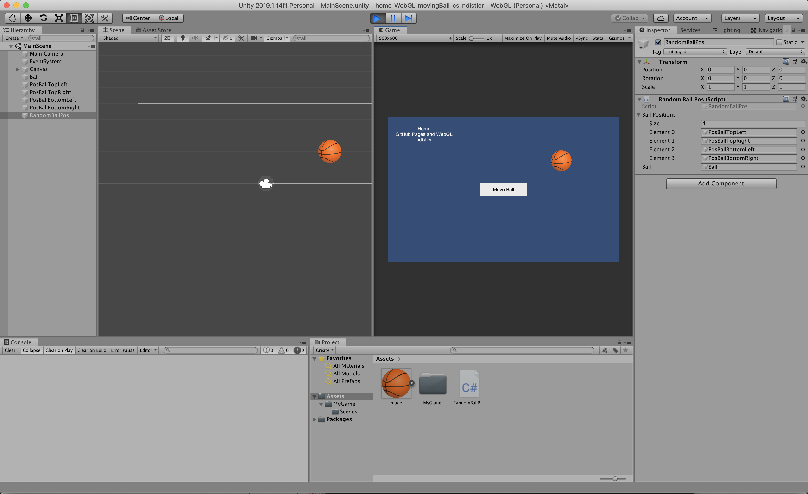

# README.md
# home-WebGL-movingBall-cs-ndistler

### Project description: 
This project contains a screen (960x600), a button (UI, button) and a ball (UI, Sprite).
If you press the button the ball will randomly move to 4 pre selected positions.
This is achieved by a C#-Script.

The game is available under: https://3ahmnm-htlsbg.github.io/home-WebGL-movingBall-cs-ndistler/

### Development platform: 
- Mac OS Mojave 
- Unity 2019.1.14f1 
- Visual Studio Code 1.40.2

### Target platform: 
WebGL 960x600

### Visuals: 

    
    

### Necessary setup/execution steps: 
WebGL needs to be installed.

### Third party material: 
Template: Unity2019114f1-2D-Template (Link: https://github.com/3ahmnm-htlsbg/Unity2019114f1-2D-Template)

### Project state: 
100% Finished

### Limitations: 
None

### Lessons Learned: 
improved my coding, learned the setposition function

Copyright by ndistler